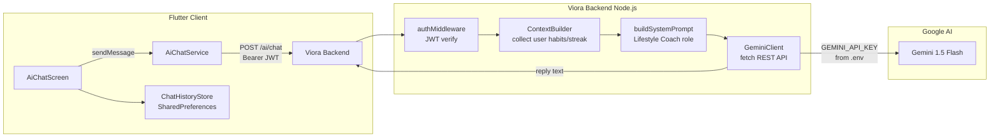
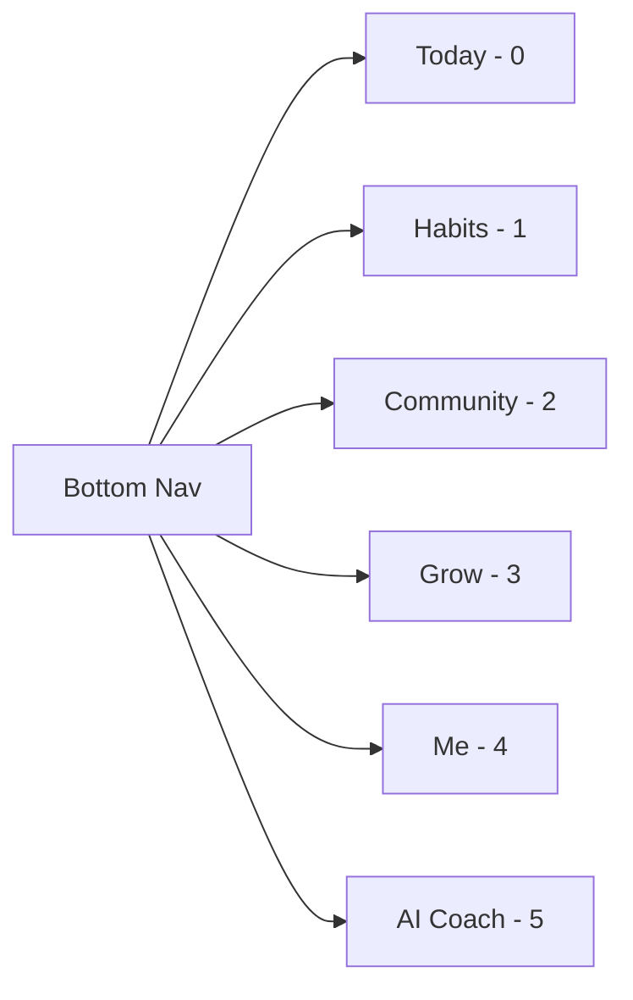

# Tài liệu Thiết kế: AI Chat Assistant

## Tổng quan

AI Chat Assistant tích hợp trợ lý ảo Gemini 1.5 Flash vào ứng dụng Viora, đóng vai một **Lifestyle Coach** (huấn luyện viên lối sống) thân thiện, tư vấn cá nhân hóa dựa trên tiến độ thói quen thực tế của từng người dùng.

API Key Gemini được bảo vệ hoàn toàn phía backend — Flutter client không bao giờ biết đến key này. Toàn bộ giao tiếp đi qua endpoint `POST /ai/chat` của Viora backend, được xác thực bằng JWT.

Lịch sử hội thoại được lưu cục bộ trên thiết bị bằng `SharedPreferences` — không cần thêm bảng database mới.

---

## Kiến trúc



**Luồng chính:**
1. Người dùng nhập tin nhắn trên `AiChatScreen`
2. `AiChatService` gửi `POST /ai/chat` kèm JWT và nội dung tin nhắn
3. Backend xác thực JWT, sau đó `ContextBuilder` lấy thói quen + streak của user
4. `buildSystemPrompt` ghép System Prompt + User Context + lịch sử hội thoại
5. `GeminiClient` gọi Gemini REST API (key từ `.env`)
6. Backend trả về `{ "reply": "..." }`, Flutter hiển thị và lưu vào `SharedPreferences`

---

## Thành phần và Giao diện

### Backend

#### `viora_backend/src/routes/ai.ts`

Router Express xử lý tất cả endpoint AI:

```typescript
POST /ai/chat
  Body: { message: string, history?: ConversationTurn[] }
  Headers: Authorization: Bearer <jwt>
  Response 200: { reply: string }
  Response 400: { message: string }
  Response 401: { message: "Unauthorized" }
  Response 503: { message: string }
```

#### `ContextBuilder`

Module nội bộ trong `ai.ts` — không export, không ghi DB:

```typescript
async function buildUserContext(userId: number): Promise<UserContext>
function formatContextText(ctx: UserContext): string
```

`UserContext`:
```typescript
interface UserContext {
  userName: string;
  habits: { name: string; category: string }[];
  completedToday: number;
  totalToday: number;
  currentStreak: number;
}
```

#### `GeminiClient`

Wrapper gọi Gemini REST API:

```typescript
async function callGemini(
  systemPrompt: string,
  userMessage: string,
  history: ConversationTurn[]
): Promise<string>

interface ConversationTurn {
  role: "user" | "model";
  parts: [{ text: string }];
}
```

#### `buildSystemPrompt(ctx: UserContext): string`

Ghép System Prompt tĩnh (vai trò Lifestyle Coach) với User Context động.

---

### Flutter

#### `AiChatService` (`viora_app/lib/services/ai_chat_service.dart`)

```dart
class AiChatService {
  static Future<String> sendMessage({
    required String token,
    required String message,
    required List<ChatMessage> history,
  });
}
```

Gọi `POST /ai/chat`, truyền lịch sử hội thoại dạng `history` để Gemini có context đa lượt.

#### `ChatHistoryStore` (`viora_app/lib/services/chat_history_store.dart`)

```dart
class ChatHistoryStore {
  static Future<List<ChatMessage>> load();   // tối đa 50 tin nhắn gần nhất
  static Future<void> save(List<ChatMessage> messages);
  static Future<void> clear();
}
```

Dùng `SharedPreferences` với key `ai_chat_history`, serialize JSON.

#### `AiChatScreen` (`viora_app/lib/screens/ai_chat_screen.dart`)

- `StatefulWidget` với `ScrollController` và `TextEditingController`
- State: `List<ChatMessage> _messages`, `bool _isLoading`, `String? _inputError`
- Load lịch sử từ `ChatHistoryStore` trong `initState`
- Auto-scroll xuống sau mỗi tin nhắn mới

#### `ChatMessage` (`viora_app/lib/models/chat_message.dart`)

```dart
class ChatMessage {
  final String role;      // "user" | "ai"
  final String content;
  final DateTime timestamp;

  Map<String, dynamic> toJson();
  factory ChatMessage.fromJson(Map<String, dynamic> json);
}
```

---

## Data Models

### ChatMessage (Flutter)

| Trường | Kiểu | Mô tả |
|--------|------|-------|
| `role` | `String` | `"user"` hoặc `"ai"` |
| `content` | `String` | Nội dung tin nhắn |
| `timestamp` | `DateTime` | Thời điểm tạo |

Serialization JSON để lưu vào `SharedPreferences`:
```json
{
  "role": "user",
  "content": "Tôi nên uống bao nhiêu nước mỗi ngày?",
  "timestamp": "2025-01-01T08:00:00.000"
}
```

### ConversationTurn (Backend → Gemini)

Gemini API yêu cầu định dạng `contents` với alternating user/model turns:
```json
{
  "role": "user" | "model",
  "parts": [{ "text": "..." }]
}
```

`ChatMessage.role = "ai"` map sang `"model"` khi gửi lên Gemini.

### Cấu trúc request `POST /ai/chat`

```json
{
  "message": "Tôi nên ngủ bao nhiêu tiếng?",
  "history": [
    { "role": "user", "content": "Xin chào", "timestamp": "..." },
    { "role": "ai", "content": "Chào bạn! ...", "timestamp": "..." }
  ]
}
```

---

## System Prompt mẫu

```
Bạn là Viora Coach — một huấn luyện viên lối sống lành mạnh thân thiện, tích cực và khoa học. 
Bạn hỗ trợ người dùng cải thiện sức khỏe thể chất và tinh thần thông qua thói quen hàng ngày.

NGUYÊN TẮC:
- Luôn trả lời bằng tiếng Việt, thân thiện và không phán xét
- Giữ câu trả lời ngắn gọn, tối đa 300 từ
- Khi phù hợp, đưa ra ít nhất 1 bước hành động cụ thể
- Nếu câu hỏi ngoài phạm vi sức khỏe, dinh dưỡng, thói quen lành mạnh — lịch sự từ chối và gợi ý quay lại chủ đề phù hợp

THÔNG TIN NGƯỜI DÙNG:
- Tên: {userName}
- Streak hiện tại: {currentStreak} ngày
- Tiến độ hôm nay: {completedToday}/{totalToday} thói quen
- Danh sách thói quen: {habitsList}

Hãy cá nhân hóa lời khuyên dựa trên thông tin trên.
```

---

## Navigation — Thêm Tab AI vào Bottom Nav

Bottom nav hiện có 5 tab (index 0–4). Tab AI sẽ là tab thứ 6 (index 5).

**Thay đổi cần thiết:**

1. `app_tabs.dart` — thêm `static const int aiChat = 5;`
2. `home_screen.dart` — thêm tab vào `navItems` list và case trong `_buildScreen`
3. `app_icons.dart` — thêm `static const aiChat = LucideIcons.bot;`
4. Dashboard tab — thêm shortcut card gọi `AppNavigation.openAiChat()`



---

## Xử lý lỗi

### Backend

| Tình huống | HTTP Status | Response |
|------------|-------------|----------|
| JWT không hợp lệ | 401 | `{ "message": "Unauthorized" }` |
| Message rỗng hoặc > 2000 ký tự | 400 | `{ "message": "Tin nhắn không hợp lệ" }` |
| `GEMINI_API_KEY` chưa cấu hình | 503 | `{ "message": "Dịch vụ AI chưa được cấu hình" }` |
| Gemini timeout / lỗi API | 503 | `{ "message": "Trợ lý AI đang bận, vui lòng thử lại sau ít phút." }` |
| Lỗi DB khi lấy context | Tiếp tục với context rỗng + log server | — |

### Flutter

| Tình huống | Hành vi |
|------------|---------|
| HTTP 400 | Hiển thị error dưới input field |
| HTTP 503 | Hiển thị bubble lỗi ở vị trí AI message |
| Mất mạng (timeout/exception) | Hiển thị SnackBar "Không có kết nối mạng. Vui lòng thử lại." |
| Bất kỳ lỗi nào | Restore lại nội dung input, enable nút gửi |

---

## Correctness Properties

*A property is a characteristic or behavior that should hold true across all valid executions of a system — essentially, a formal statement about what the system should do. Properties serve as the bridge between human-readable specifications and machine-verifiable correctness guarantees.*

### Property 1: Alignment tin nhắn theo role

*For any* danh sách `ChatMessage` với role `"user"` hoặc `"ai"`, khi render UI, mỗi tin nhắn có `role == "user"` phải được align bên phải và mỗi tin nhắn có `role == "ai"` phải được align bên trái.

**Validates: Requirements 1.1**

---

### Property 2: Tin nhắn hợp lệ xuất hiện trong danh sách sau khi gửi

*For any* chuỗi tin nhắn không rỗng và không chỉ chứa whitespace, sau khi trigger hành động gửi, tin nhắn đó phải xuất hiện trong `_messages` với đúng nội dung và `role == "user"`.

**Validates: Requirements 1.3**

---

### Property 3: Nút gửi bị disable khi input không hợp lệ

*For any* chuỗi chỉ chứa whitespace (hoặc rỗng), nút gửi phải ở trạng thái disabled; *for any* chuỗi chứa ít nhất một ký tự không phải whitespace, nút gửi phải ở trạng thái enabled.

**Validates: Requirements 1.6**

---

### Property 4: Context Builder tạo output chứa đủ trường

*For any* `UserContext` hợp lệ (có `userName`, `habits`, `completedToday`, `totalToday`, `currentStreak`), hàm `formatContextText` phải trả về chuỗi chứa tên người dùng, thông tin streak, và tiến độ hoàn thành.

**Validates: Requirements 3.1, 3.4**

---

### Property 5: System Prompt chứa User Context

*For any* `UserContext`, hàm `buildSystemPrompt` phải trả về chuỗi chứa đầy đủ thông tin context người dùng (tên, streak, tiến độ).

**Validates: Requirements 4.4**

---

### Property 6: ChatMessage serialization round-trip

*For any* `ChatMessage` với `role`, `content`, và `timestamp` hợp lệ, gọi `ChatMessage.fromJson(message.toJson())` phải trả về object có đầy đủ và bằng nhau các trường gốc.

**Validates: Requirements 7.4**

---

### Property 7: Lưu và tải lịch sử giữ nguyên dữ liệu

*For any* danh sách `ChatMessage` có độ dài bất kỳ, sau khi `ChatHistoryStore.save(messages)` rồi `ChatHistoryStore.load()`, danh sách trả về phải chứa đúng nội dung các tin nhắn gốc (giới hạn 50 tin nhắn gần nhất).

**Validates: Requirements 7.1, 7.2**

---

### Property 8: Input được restore khi request lỗi

*For any* nội dung tin nhắn được nhập, nếu `AiChatService.sendMessage` ném lỗi, `TextEditingController.text` phải vẫn chứa nội dung tin nhắn ban đầu sau khi xử lý lỗi.

**Validates: Requirements 6.5**

---

## Testing Strategy

### Dual Testing Approach

Kết hợp unit tests (ví dụ cụ thể, edge case) và property-based tests (universal properties) để có coverage toàn diện.

### Property-Based Testing

Sử dụng:
- **Dart/Flutter**: [`fast_check`](https://pub.dev/packages/fast_check) hoặc [`glados`](https://pub.dev/packages/glados)
- **Node.js/TypeScript**: [`fast-check`](https://www.npmjs.com/package/fast-check)

Mỗi property test chạy tối thiểu **100 iterations**.

Tag format cho mỗi test: `// Feature: ai-chat-assistant, Property N: <tóm tắt>`

**Property tests cần implement:**

| Property | File | Library |
|----------|------|---------|
| P1: Message alignment | `test/widgets/ai_chat_screen_test.dart` | glados |
| P2: Message appears after send | `test/widgets/ai_chat_screen_test.dart` | glados |
| P3: Send button disabled/enabled | `test/widgets/ai_chat_screen_test.dart` | glados |
| P4: Context Builder output | `test/services/chat_history_store_test.dart` | glados |
| P5: System Prompt contains context | `test/backend/ai_route_test.ts` | fast-check |
| P6: ChatMessage round-trip | `test/models/chat_message_test.dart` | glados |
| P7: History save/load | `test/services/chat_history_store_test.dart` | glados |
| P8: Input restore on error | `test/widgets/ai_chat_screen_test.dart` | glados |

### Unit & Integration Tests

**Backend (`viora_backend/src/routes/ai.test.ts`):**
- Kiểm tra 401 khi không có JWT
- Kiểm tra 400 khi message rỗng hoặc > 2000 ký tự
- Kiểm tra 503 khi `GEMINI_API_KEY` chưa cấu hình (mock env)
- Kiểm tra 503 khi Gemini API trả lỗi (mock fetch)
- Kiểm tra response shape `{ reply: string }` với mock Gemini thành công
- Kiểm tra `ContextBuilder` với habits data null/empty (edge case 3.3)

**Flutter (`test/screens/ai_chat_screen_test.dart`):**
- Typing indicator hiển thị khi loading
- Typing indicator ẩn sau khi nhận phản hồi
- Error bubble hiển thị khi 503
- Error message dưới input khi 400
- SnackBar khi mất mạng
- Nút xóa lịch sử hoạt động đúng

### Test Edge Cases

- `ContextBuilder` với `habits = []` (không có thói quen)
- `ContextBuilder` với `habits = null` (lỗi DB)
- `ChatHistoryStore.load()` với > 50 tin nhắn → phải trả về đúng 50 cái cuối
- `ChatMessage.fromJson` với timestamp không hợp lệ
- Tin nhắn dài 2000 ký tự (giới hạn max, phải thành công)
- Tin nhắn dài 2001 ký tự (vượt giới hạn, phải bị từ chối)
