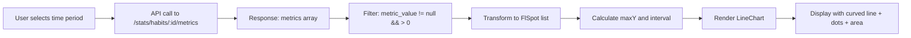

# Design Document: Habit Detail Statistics Chart

## Overview

This feature enhances the existing habit detail screen by improving the line chart visualization to display metric values (calories, milliliters, hours, etc.) on the Y-axis and dates on the X-axis. The chart will show trends over selectable time periods (7, 30, or 90 days) with smooth curved lines, visible data points, and a shaded area below the line.

The implementation builds upon the existing `HabitDetailScreen` widget and leverages the `fl_chart` library (version 0.69.0) already integrated in the project. The backend API endpoint `/stats/habits/:habitId/metrics` already provides the necessary data structure.

### Key Design Goals

1. **Visual clarity**: Display metric values with appropriate units on Y-axis and dates on X-axis
2. **Smooth visualization**: Use curved line interpolation with visible data points
3. **Performance**: Render charts efficiently even with 90 data points
4. **Data accuracy**: Only display days with actual metric values (> 0)
5. **Responsive design**: Adapt axis labels based on time period selection

## Architecture

### Component Structure

```
HabitDetailScreen (existing)
├── _buildTimeRangeSelector() (existing)
├── _buildSummaryCards() (existing)
└── _buildMetricsChart() (to be enhanced)
    ├── Data Processing Layer
    │   ├── Filter metrics with non-null metric_value
    │   ├── Convert metric_value to double
    │   └── Build FlSpot list and date labels
    ├── Chart Configuration Layer
    │   ├── Calculate maxY with 30% margin
    │   ├── Calculate grid interval
    │   └── Configure axis titles
    └── Rendering Layer (fl_chart)
        ├── LineChartBarData (line + dots + area)
        ├── FlGridData (horizontal grid lines)
        ├── FlTitlesData (axis labels)
        └── FlBorderData
```

### Data Flow



## Components and Interfaces

### 1. Data Models

#### Metric Data Structure (from API)
```dart
{
  "habit": {
    "id": int,
    "name": String,
    "unit": String?,  // "cal", "ml", "giờ", or custom
    "current_streak": int,
    "longest_streak": int,
    "total_logs": int
  },
  "metrics": [
    {
      "log_date": String,  // "YYYY-MM-DD"
      "metric_value": double?  // null or numeric value
    }
  ],
  "summary": {
    "unit": String?,
    "total_value": double?,
    "average_value": double?
  }
}
```

#### Chart Data Structure (internal)
```dart
class ChartData {
  final List<FlSpot> spots;
  final List<String> dateLabels;
  final double maxY;
  final double interval;
  final String unit;
}
```

### 2. Enhanced _buildMetricsChart() Method

**Responsibilities:**
- Filter metrics to include only entries with non-null, positive metric_value
- Transform filtered data into FlSpot coordinates
- Calculate appropriate Y-axis range (0 to maxValue * 1.3)
- Calculate grid interval for readability
- Configure axis labels with proper formatting
- Render line chart with curved interpolation, dots, and shaded area

**Input:**
- `metrics`: List of metric objects from API
- `summary`: Summary object containing unit information
- `habitInfo`: Habit information including unit

**Output:**
- Widget displaying the line chart or SizedBox.shrink() if no data

### 3. Chart Configuration

#### Line Chart Properties
```dart
LineChartBarData(
  spots: List<FlSpot>,           // Data points
  isCurved: true,                // Smooth curved line
  color: AppColors.primary,      // Green color
  barWidth: 3,                   // Line thickness
  dotData: FlDotData(
    show: true,                  // Show dots at data points
    getDotPainter: ...           // 5px radius, green with white stroke
  ),
  belowBarData: BarAreaData(
    show: true,                  // Show shaded area
    color: primary with 10% opacity
  )
)
```

#### Axis Configuration

**Y-Axis (Left):**
- Range: 0 to maxValue * 1.3
- Interval: (maxY / 5).clamp(0.1, infinity)
- Labels: Integer format for values >= 10, one decimal place for values < 10
- Reserved space: 45px

**X-Axis (Bottom):**
- Labels: DD/MM format
- Interval: 1 (show all dates for filtered data)
- Spacing: Automatic based on number of data points
- Padding: 8px top

#### Grid Configuration
- Show horizontal grid lines only
- Interval: Same as Y-axis interval
- Color: textSecondary with 10% opacity
- Stroke width: 1px

## Data Models

### Metric Value Handling

The system must handle metric_value in multiple formats:
- `null`: No metric recorded (skip this data point)
- `number`: Direct numeric value
- `string`: Numeric string that needs parsing

```dart
double parseMetricValue(dynamic metricValue) {
  if (metricValue == null) return 0.0;
  if (metricValue is num) return metricValue.toDouble();
  if (metricValue is String) return double.tryParse(metricValue) ?? 0.0;
  return 0.0;
}
```

### Date Label Formatting

Input: "YYYY-MM-DD" (e.g., "2026-05-20")
Processing: Extract "MM-DD" substring
Output: "DD/MM" format (e.g., "20/05")

```dart
String formatDateLabel(String logDate) {
  final parts = logDate.substring(5).split("-");  // Get "MM-DD"
  return "${parts[1]}/${parts[0]}";  // Return "DD/MM"
}
```

### Unit Display

Units are displayed in multiple locations:
1. Y-axis: Implicit (shown in chart subtitle)
2. Chart subtitle: "Giá trị ghi nhận mỗi ngày (unit)"
3. Summary cards: Appended to values (e.g., "150.5 cal")

## Error Handling

### 1. No Data Scenarios

**Case 1: Empty metrics array**
- Condition: `metrics.isEmpty`
- Action: Display empty state message
- Message: "Chưa có dữ liệu" / "Hãy check-in thói quen này để xem thống kê"

**Case 2: All metrics have null or zero metric_value**
- Condition: `spots.isEmpty` after filtering
- Action: Return `SizedBox.shrink()` (hide chart)
- Note: Empty state is shown at screen level, not chart level

**Case 3: Partial data**
- Condition: Some metrics have values, others don't
- Action: Display chart with only valid data points
- Behavior: Line connects only the available data points

### 2. Data Parsing Errors

**Invalid metric_value format:**
- Use `double.tryParse()` with fallback to 0.0
- Skip data points with 0.0 values

**Invalid date format:**
- Use substring extraction with bounds checking
- Fallback: Display empty string if index out of range

### 3. API Errors

**Network failure:**
- Handled by existing `isLoading` state
- Display loading indicator during fetch
- Show error via existing error handling mechanism

**Timeout:**
- HTTP client default timeout applies
- User can pull-to-refresh to retry

### 4. Performance Safeguards

**Large dataset (90 days):**
- Chart library handles rendering optimization
- No additional pagination needed
- Smooth scrolling maintained by fl_chart

**Memory constraints:**
- Data is loaded on-demand per time period selection
- Previous data is garbage collected when new period is selected

## Testing Strategy

This feature involves UI rendering and visualization, which is not suitable for property-based testing. The testing strategy will focus on:

### 1. Unit Tests

**Data Processing Tests:**
- Test metric value parsing (null, number, string formats)
- Test date label formatting (various date formats)
- Test data filtering (null values, zero values, positive values)
- Test maxY calculation with different value ranges
- Test interval calculation for grid lines

**Edge Cases:**
- Empty metrics array
- All null metric values
- All zero metric values
- Single data point
- Very large values (> 1000)
- Very small values (< 1)
- Mixed valid and invalid data

**Example Test Cases:**
```dart
test('parseMetricValue handles null', () {
  expect(parseMetricValue(null), 0.0);
});

test('parseMetricValue handles numeric string', () {
  expect(parseMetricValue("150.5"), 150.5);
});

test('formatDateLabel converts YYYY-MM-DD to DD/MM', () {
  expect(formatDateLabel("2026-05-20"), "20/05");
});

test('filters out null and zero metric values', () {
  final metrics = [
    {"log_date": "2026-05-20", "metric_value": 100.0},
    {"log_date": "2026-05-21", "metric_value": null},
    {"log_date": "2026-05-22", "metric_value": 0.0},
    {"log_date": "2026-05-23", "metric_value": 150.0},
  ];
  final spots = buildSpots(metrics);
  expect(spots.length, 2);
});
```

### 2. Widget Tests

**Chart Rendering Tests:**
- Verify chart displays when data is available
- Verify empty state displays when no data
- Verify chart hides when all values are null/zero
- Verify time period selector updates chart
- Verify axis labels display correctly

**Visual Regression Tests:**
- Snapshot test for 7-day chart
- Snapshot test for 30-day chart
- Snapshot test for 90-day chart
- Snapshot test for empty state
- Snapshot test for different units (cal, ml, giờ)

### 3. Integration Tests

**End-to-End Flow:**
- Navigate to habit detail screen
- Verify chart loads with default 30-day period
- Switch to 7-day period and verify chart updates
- Switch to 90-day period and verify chart updates
- Verify chart displays correct data from API
- Verify pull-to-refresh updates chart

**Performance Tests:**
- Measure chart render time (should be < 2 seconds)
- Verify smooth scrolling with 90 data points
- Test on devices with 2GB RAM minimum

### 4. Manual Testing Checklist

- [ ] Chart displays with correct units for each habit category
- [ ] Y-axis shows values from 0 to max + 30%
- [ ] X-axis shows dates in DD/MM format
- [ ] Line is curved and smooth
- [ ] Dots are visible at each data point
- [ ] Shaded area appears below line with 10% opacity
- [ ] Grid lines are visible and properly spaced
- [ ] Time period selector switches work correctly
- [ ] Empty state displays when no data
- [ ] Chart updates within 2 seconds when changing period
- [ ] Chart works for all habit categories (eat, hydration, sleep, etc.)
- [ ] Chart handles custom units correctly

### Test Coverage Goals

- Unit test coverage: > 80% for data processing logic
- Widget test coverage: All chart rendering scenarios
- Integration test coverage: Critical user flows
- Manual testing: All acceptance criteria verified

## Implementation Notes

### 1. Existing Code Preservation

The current implementation in `habit_detail_screen.dart` already has most of the required functionality. The enhancement focuses on:
- Ensuring Y-axis displays metric values with units
- Ensuring X-axis displays dates in DD/MM format
- Verifying curved line interpolation is enabled
- Confirming dots and shaded area are visible
- Validating data filtering logic

### 2. Library Version

The project uses `fl_chart: ^0.69.0` which supports all required features:
- Curved line interpolation (`isCurved: true`)
- Custom dot painters (`FlDotCirclePainter`)
- Below-bar area shading (`BarAreaData`)
- Custom axis title widgets (`getTitlesWidget`)

### 3. Color Scheme

Uses existing app theme colors:
- Primary line color: `AppColors.primary` (green)
- Dot color: `AppColors.primary`
- Dot stroke: `context.cardColor` (white/dark based on theme)
- Shaded area: `AppColors.primary.withValues(alpha: 0.1)`
- Grid lines: `context.textSecondary.withValues(alpha: 0.1)`

### 4. Responsive Design

The chart adapts to different screen sizes:
- Fixed height: 200px (adequate for mobile screens)
- Horizontal scrolling: Not needed (fl_chart auto-scales X-axis)
- Label spacing: Automatic based on data point count
- Reserved space for Y-axis labels: 45px (accommodates 4-digit numbers)

### 5. Performance Optimization

- Data filtering happens once per render
- FlSpot list is built incrementally during filtering
- No unnecessary widget rebuilds (data is cached in state)
- Chart library handles rendering optimization internally

### 6. Accessibility

- Chart subtitle provides context for screen readers
- Color contrast meets WCAG AA standards (green on white/dark background)
- Empty state message is clear and actionable
- Time period selector has clear visual feedback

## Dependencies

### Existing Dependencies
- `fl_chart: ^0.69.0` - Chart rendering library
- `http: ^1.2.0` - API communication
- `shared_preferences: ^2.2.2` - Token storage

### No New Dependencies Required

All required functionality is available in the existing dependencies.

## Migration and Compatibility

### Database Compatibility

The feature uses existing database schema:
- Table: `habit_logs`
- Field: `metric_value` (already exists based on API response structure)
- No schema changes required

### API Compatibility

The feature uses existing API endpoint:
- Endpoint: `GET /stats/habits/:habitId/metrics?days={days}`
- Response format: Already includes `metric_value` field
- No API changes required

### Backward Compatibility

- Existing habits without metric values will show empty state
- Existing habits with metric values will display chart
- No data migration needed
- No breaking changes to existing functionality

## Deployment Considerations

### Testing Before Release

1. Test with existing user data (habits with and without metrics)
2. Test all time periods (7, 30, 90 days)
3. Test all habit categories (eat, hydration, sleep, etc.)
4. Test on multiple device sizes and OS versions
5. Verify performance on low-end devices (2GB RAM)

### Rollout Strategy

1. Deploy to staging environment
2. Conduct internal testing with real data
3. Beta test with small user group
4. Monitor performance metrics
5. Full release to production

### Monitoring

- Track chart render times (should be < 2 seconds)
- Monitor API response times for metrics endpoint
- Track error rates for data parsing
- Monitor user engagement with time period selector

### Rollback Plan

If issues are discovered:
1. Revert to previous version of `habit_detail_screen.dart`
2. No database rollback needed (no schema changes)
3. No API rollback needed (no API changes)
